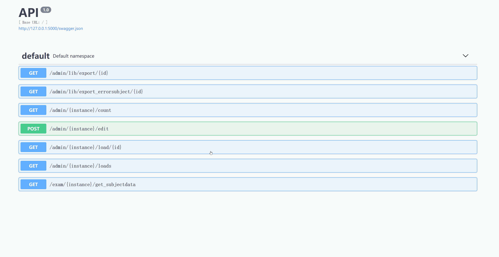

# webexam

## useage

### windows powershell

- create venv\
`python3 -m venv venv`
- activate venv\
  `./venv/Scripts/activate.ps1`
- install dependence\
  `pip install -r requirements.txt`
- set env\
  `$Env:FLASK_APP="runserver.py"`\
  `$Env:FLASK_DEBUG="1"`
- run app\
  `flask run --host 0.0.0.0 -p 10000`

### linux

linux

- create venv\
  `python3 -m venv venv`
- activate venv\
  `source venv/bin/activate`
- install dependence\
  `pip install -r requirements.txt`
- set env\
  `export FLASK_APP="runserver.py"`
  `export FLASK_DEBUG="1"`
- run app\
  `flask run --host 0.0.0.0 -p 10000`
  
